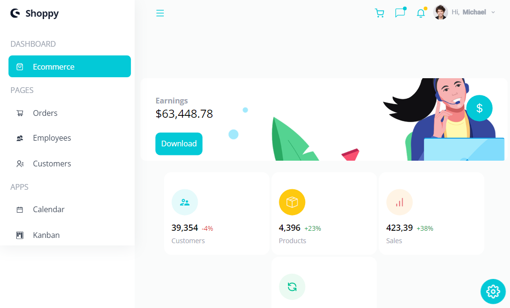

# **React Admin Dashboard App With Theming, Tables, Charts, Calendar, Kanban and More**





### Table of Contents

- [Description](#description)
- [Technologies](#technologies)
- [Installation](#installation)
- [Author Info](#author-info)

---

## Description

Admin Panel includes one Dashboard, Three Pages, Four Apps, and Seven fully functional charts!
Advanced React Best Practices such as folder and file structure, hooks, and refs
- Advanced State Management of the entire application using React Context API
- And most importantly you’ll learn how to use Syncfusion - World's Best UI Component Suite for Building Powerful Web, Desktop, and Mobile Apps

#### Technologies

- React.js
- Context API
- Syncfusion

---
#### Installation
```bash
# install dependencies
$ yarn install

# serve with hot reload at localhost:3000
$ yarn dev

# build for production and launch server
$ yarn build
$ yarn start

# generate static project
$ yarn generate
```

---

## Author Info

- LinkedIn - [@Ines-Bouguerra](https://www.linkedin.com/in/ines-bouguerra/)
- Website - [Ines Bouguerra](https://inesportfolio.herokuapp.com/)
